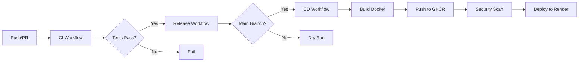

# 🚀 CI/CD + Semantic Release — FastAPI CRUD App

<div align="center">


</div>

<p align="center">
    
</p>

<p align="center">
  <strong>A production-ready FastAPI CRUD application with automated CI/CD pipelines</strong>
</p>


---

## 📋 Table of Contents

- [✨ Overview](#-overview)
- [🎯 Key Features](#-key-features)
- [📁 Project Structure](#-project-structure)
- [🛠️ Tech Stack](#️-tech-stack)
- [⚙️ Installation](#️-installation)
- [🔧 Configuration](#-configuration)
- [▶️ Running the App](#️-running-the-app)
- [📡 API Usage](#-api-usage)
- [🧪 Tests](#-tests)
- [🔄 CI/CD Pipeline](#-cicd-pipeline)
- [🗺️ Roadmap](#️-roadmap)
- [🤝 Contributing](#-contributing)
- [📄 License](#-license)
- [🙏 Acknowledgements](#-acknowledgements)

---

## ✨ Overview

This repository showcases a **minimal, production-like FastAPI application** with a complete Items CRUD system. It serves as a comprehensive reference for implementing robust CI/CD pipelines with semantic versioning and automation.

### What's Inside?

- 🎯 **FastAPI service** with SQLModel models and PostgreSQL configuration
- 🏗️ **Clean architecture** with separated business logic layer
- 🤖 **Automated releases** using python-semantic-release
- ✅ **Comprehensive CI checks**: linting (ruff), testing (pytest), type checking (mypy)
- 📚 **Auto-deployed documentation** via MkDocs
- 🐳 **Docker support** with helper scripts for builds

> **Perfect for:** Learning semantic-release integration with Python and building reliable CI/CD pipelines that automate versioning, changelogs, and publishing.

---

## 🎯 Key Features

<table>
<tr>
<td width="50%">

### 🏛️ Architecture
- Clean FastAPI app with SQLModel + SQLAlchemy
- Well-separated service layer
- PostgreSQL for production, SQLite for tests

</td>
<td width="50%">

### 🔬 Quality Assurance
- Full test coverage with pytest
- Unit and integration tests
- Type checking with mypy

</td>
</tr>
<tr>
<td width="50%">

### 🤖 Automation
- Semantic-release for versioning
- Automated changelog generation
- GitHub Actions CI/CD pipeline

</td>
<td width="50%">

### 🐳 Deployment
- Docker containerization
- GHCR image publishing
- Trivy security scanning
- Automated Render deployment

</td>
</tr>
</table>

---

## 📁 Project Structure

```
.
├── 🔧 .github/
│   └── workflows/
│       ├── ci.yml            # CI checks — lint, tests, docs
│       ├── release.yml       # Automated releases
│       └── cd.yml            # Container builds & deployment
│
├── 📦 app/
│   ├── main.py               # FastAPI application entry point
│   ├── database.py           # Database configuration
│   ├── logging_config.py     # Centralized logging
│   ├── models/               # SQLModel data models
│   ├── routes/               # API route handlers
│   ├── schemas/              # Pydantic schemas
│   └── services/             # Business logic layer
│
├── 📚 docs/                  # MkDocs documentation
├── 🧪 tests/                 # Test suite (pytest)
├── 📜 scripts/               # Helper scripts
├── 🐳 Dockerfile             # Container definition
├── 📝 CHANGELOG.md           # Auto-generated changelog
├── ⚙️ pyproject.toml         # Project configuration
└── 📖 README.md              # You are here!
```

---

## 🛠️ Tech Stack

<div align="center">

| Category | Technologies |
|----------|-------------|
| **Language** |  |
| **Framework** |  |
| **Database** |   |
| **ORM** |  |
| **CI/CD** |   |
| **Container** |   |
| **Docs** |  |
| **Tools** |   |

</div>

---

## ⚙️ Installation

> **Prerequisites:** macOS/Linux with zsh. This project uses `uv` (Astral) for fast dependency management.

### 📥 Step 1: Clone the Repository

```bash
git clone https://github.com/MichAdebayo/CI-CD-semantic-release.git
cd CI-CD-semantic-release
```

### 🔨 Step 2: Install uv (Astral)

```bash
curl -LsSf https://astral.sh/uv/install.sh | sh
```

### 📦 Step 3: Install Dependencies

```bash
# Sync all dependencies to virtual environment
uv sync --dev
```

### 🔐 Step 4: Configure Environment (Optional)

```bash
# Copy example environment file
cp .env.example .env

# Edit with your values
# DATABASE_URL="SET_YOUR_DB_URL"
# DEBUG_MODE="SET_DEBUG_MODE"
```

---

## 🔧 Configuration

### 🌍 Environment Variables

| Variable | Description | Required |
|----------|-------------|----------|
| `DATABASE_URL` | PostgreSQL connection string | ✅ Production |
| `DEBUG_MODE` | Enable FastAPI debug mode | ❌ Optional |
| `GITHUB_TOKEN` | Token for semantic-release | ✅ CI/CD |

### 🔒 CI/CD Secrets

Configure these in your GitHub repository settings:

<details>
<summary><b>🤖 GitHub App Configuration (Click to expand)</b></summary>

<br>

**Required Secrets:**
- `APP_ID` — GitHub App ID for release workflow
- `APP_PRIVATE_KEY_B64` — Base64-encoded private key
- `DEPLOY_URL` — Render webhook URL
- `GHCR_PAT` / `GHCR_USER` — Optional: manual GHCR credentials

**Setup Steps:**

1. Navigate to **GitHub → Settings → Developer settings → GitHub Apps**
2. Click **New GitHub App**
3. Configure permissions: `contents: write`, `packages: write`, `actions: write`
4. Generate a private key and encode it:
   ```bash
   base64 -i private-key.pem | pbcopy
   ```
5. Add secrets to your repository

</details>

> ⚠️ **Security Note:** Never commit secrets to the repository. Use `.env.example` with placeholders only.

---

## ▶️ Running the App

### 🚀 Development Server (Hot Reload)

```bash
# FastAPI dev mode
uv run fastapi dev app/main.py

# Or with uvicorn directly
uv run uvicorn app.main:app --reload --host 0.0.0.0 --port 8000
```

### 🐳 Production (Docker)

```bash
# Build image
./scripts/docker-build.sh myorg/items:latest

# Run container
docker run -p 8000:8000 \
  --env DATABASE_URL="postgresql://..." \
  myorg/items:latest
```

### 🌐 Access the Application

- **API Root:** http://127.0.0.1:8000/
- **Health Check:** http://127.0.0.1:8000/health
- **Interactive Docs:** http://127.0.0.1:8000/docs
- **ReDoc:** http://127.0.0.1:8000/redoc

---

## 📡 API Usage

### 📌 Endpoints Overview

<table>
<tr>
<th>Method</th>
<th>Endpoint</th>
<th>Description</th>
</tr>
<tr>
<td><code>GET</code></td>
<td><code>/</code></td>
<td>Root endpoint</td>
</tr>
<tr>
<td><code>GET</code></td>
<td><code>/health</code></td>
<td>Health check</td>
</tr>
<tr>
<td><code>POST</code></td>
<td><code>/items</code></td>
<td>Create new item</td>
</tr>
<tr>
<td><code>GET</code></td>
<td><code>/items</code></td>
<td>List all items</td>
</tr>
<tr>
<td><code>GET</code></td>
<td><code>/items/{id}</code></td>
<td>Get item by ID</td>
</tr>
<tr>
<td><code>PUT</code></td>
<td><code>/items/{id}</code></td>
<td>Update item</td>
</tr>
<tr>
<td><code>DELETE</code></td>
<td><code>/items/{id}</code></td>
<td>Delete item</td>
</tr>
</table>

### 💡 Example Requests

<details>
<summary><b>Create Item</b></summary>

```bash
curl -X POST http://127.0.0.1:8000/items \
  -H "Content-Type: application/json" \
  -d '{"nom":"Keyboard","prix":49.99}'
```

</details>

<details>
<summary><b>Get All Items</b></summary>

```bash
curl http://127.0.0.1:8000/items
```

</details>

<details>
<summary><b>Get Single Item</b></summary>

```bash
curl http://127.0.0.1:8000/items/1
```

</details>

<details>
<summary><b>Update Item</b></summary>

```bash
curl -X PUT http://127.0.0.1:8000/items/1 \
  -H "Content-Type: application/json" \
  -d '{"prix":59.99}'
```

</details>

<details>
<summary><b>Delete Item</b></summary>

```bash
curl -X DELETE http://127.0.0.1:8000/items/1
```

</details>

---

## 🧪 Tests

### 🏃 Running Tests

```bash
# Run all tests
uv run pytest -q

# With coverage
uv run pytest --cov=app tests/

# Verbose output
uv run pytest -v
```

### 📊 Test Coverage

The test suite includes:

- ✅ **Unit tests** for models and service layer
- ✅ **Integration tests** for API endpoints
- ✅ **Edge case handling** and error scenarios
- ✅ **In-memory SQLite** for fast test execution

---

## 🔄 CI/CD Pipeline

### 🏗️ Workflow Architecture

<div align="center">


</div>

### 📋 Workflow Details

<table>
<tr>
<th>Workflow</th>
<th>Trigger</th>
<th>Actions</th>
</tr>
<tr>
<td><b>CI</b><br><code>ci.yml</code></td>
<td>Push/PR to<br><code>main</code>, <code>develop</code></td>
<td>
• Install dependencies<br>
• Run linting (ruff)<br>
• Execute tests (pytest)<br>
• Type check (mypy)<br>
• Deploy docs (MkDocs)<br>
• Trigger release workflow
</td>
</tr>
<tr>
<td><b>Release</b><br><code>release.yml</code></td>
<td>Called by CI</td>
<td>
• Authenticate via GitHub App<br>
• Run semantic-release<br>
• Generate changelog<br>
• Create GitHub Release<br>
• Trigger CD workflow
</td>
</tr>
<tr>
<td><b>CD</b><br><code>cd.yml</code></td>
<td>Successful release</td>
<td>
• Prepare Docker tags<br>
• Build & push to GHCR<br>
• Run Trivy security scan<br>
• Trigger Render deployment
</td>
</tr>
</table>


### 🌿 Branch Strategy


| Branch | Purpose | Release Type |
|--------|---------|--------------|
| `main` | 🚀 Production | Stable releases + Deploy |
| `develop` | 🧪 Development | Prereleases |
| `deploy/ci_cd` | 🔧 CI/CD Testing | CI/CD prereleases |


### 🔐 Security & Authentication

- **GitHub App Token**: Short-lived, scoped tokens for releases
- **Least Privilege**: Minimal permissions for each workflow
- **Secret Management**: All credentials in GitHub Secrets
- **Vulnerability Scanning**: Trivy scans on every image build

### 🛠️ Local Release Testing

```bash
# Dry run (shows next version)
./scripts/release.sh

# Publish release (requires GITHUB_TOKEN)
GITHUB_TOKEN=ghp_... ./scripts/release.sh --publish --yes
```

---

## 🗺️ Roadmap

- 🔗 Add contract tests for API endpoints
- 💬 Add CI notifications (Slack/MS Teams)
- 🔐 Implement API authentication
- 📊 Add monitoring and observability

---

## 🤝 Contributing

Contributions are welcome! Here's how to get started:

### 📝 Guidelines

1. **Fork** the repository
2. Create a **feature branch** (`git checkout -b feature/amazing-feature`)
3. Use **conventional commits** for semantic versioning
4. Add **tests** for new functionality
5. Run **linting** and **formatting**
6. Submit a **pull request** with clear description

### 🔍 Pre-commit Checklist

```bash
# Lint code
uv run ruff check app tests

# Format code
uv run ruff format app tests

# Run tests
uv run pytest -q

# Type check
uv run mypy app
```

### 💬 Commit Convention

```
feat: add new feature
fix: resolve bug
docs: update documentation
test: add test coverage
chore: maintenance tasks
```

---

## 📄 License

This project is licensed under the **MIT License** - see the [LICENSE](LICENSE) file for details.

---

<div align="center">

### 👨‍💻 Author

**[Michael Adebayo](https://github.com/MichAdebayo)**

[](https://github.com/MichAdebayo)
[](https://linkedin.com/in/your-profile)

---

⭐ **If you find this project helpful, please give it a star!** ⭐

</div>
